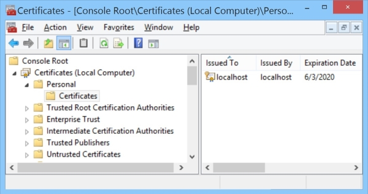
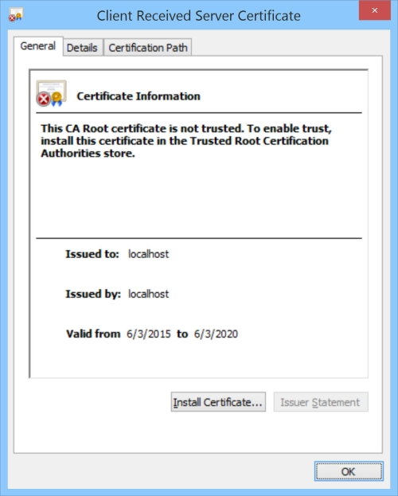

# A Windows Client and Server Using TLS Over TCP

Jun 16, 2015, last updated June 6, 2025 for version 2.1.7

## Introduction

This is a project (several, technically) to demonstrate how to use the Microsoft implementation of TLS (called SCHANNEL) from C++. It provides a working example of a multi-threaded server using TLS and a client which can connect to it. There's also a very simple example client which connects to a commodity web server, just to show the simplest possible usage, as well as a couple of sample .NET clients - I won't discuss them any further here but the samples (called SimpleClient, SimpleClientCs and StreamClientCs) are available as projects in the solution if you want them. It was originally written as a CodeProject article in response to the number of people who felt forced to use OpenSSL on Windows because they could not find a simple example of how to use TLS in C++ with Windows' native TLS implementation.

If you are familiar with TLS this sample supports SNI and wild card SAN certificates on both the server and, optionally, the client, as well as providing flexible certificate selection and acceptance. If you're unfamiliar with the world of TLS, the preceding sentence was probably meaningless, but this sample provides some code that's intended to be easy to reuse for a simple, or complex, client and server and if you are really interested this article should explain what that sentence meant.

## Background

Transport Layer Security (TLS) is a means by which data can be moved between two endpoints securely and reliably. Using it, you can verify the other end of a connection is who it claims to be, and/or encrypt data as it passes between the two endpoints. The predecessor to TLS was SSL (Secure Socket Layer) but the terms SSL and TLS are often used interchangeably, and earlier versions of this article mostly used SSL, as do many of the names in the code base.

TLS relies on a public key infrastructure, and generally those keys live in a certificate store. In the Microsoft world, the usual store is an encrypted portion of the registry (Java and OpenTLS do it differently). There are a set of named stores for the whole machine and a set for each user, all viewable using an MMC snap-in.



Generally, servers get their certificate (which contains the public key and points to a private one) from the machine store called "personal" (oddly, it's called "my" in code) and clients get their certificate from the per-user store called "personal" (likewise "my" in code). Clients generally do not use certificates at all, since client certificates are optional unless the server says it requires one; this sample server does require one by default, but the sample client can create a suitable one if necessary. Broadly speaking, the server certificate identifies the system, and the client certificate (if there is one) usually identifies a particular user. That is the most common setup, but the minimum requirement is merely that the server supply a certificate. For more details, see [Creating Digital Certificates](#Creating-DigitalCertificates).

## Client Overview

The client tries to open a TCP socket to port number 41000 on a names host you specify using a command line parameter (the name defaults to the DNS name of the local host). Once that socket is open, the client initiates a TLS handshake (an initial exchange of data to agree on the options used for communication) and validates the certificate the server provides. The server requests a client certificate and the client selects one likely to be trusted by the server if possible, otherwise it selects one (somewhat arbitrarily) from the user personal store and if it cannot find one, it creates one. The client and server are console applications, so they display progress on the console. If you run a debug version in the debugger, there's also a lot of detailed information in the output window.

## Server Overview

The server waits on an incoming connection on port number 41000, and when one arrives, it hands the socket for the connection to a newly initiated thread for processing (this is a common pattern for servers which do significant work for each new socket). Like the client, it is a console application, so it displays progress on the console. Like the client, if you run a debug build and attach a debugger, there's a lot of detailed output.

Once a thread is initiated, it waits for the client at the other end of the socket to initiate a TLS handshake (or until it eventually times out). As part of the handshake, the client will provide a Server Name Indication (SNI) to tell the TLS server what server name it is trying to connect to. Armed with the required name, each thread will look for an appropriately named certificate in the machine store (subsequent connections requesting the same host name use the same certificate). The chosen certificate must meet other requirements too, such as having a private key and being marked as usable for server identification. Then the server requests a client certificate from the client and optionally validates that before marking the connection as successful.

The server has a bit of code at the end to automatically initiate a couple of client instances, one connecting to the server name "localhost" the other is just allowed to default to the local host name. This makes testing a bit easier and allows you to see certificates being selected and/or created and messages being exchanged without needing to run a separate client application. If you want to run the server without the automatic clients, just comment out the call to `InitiateTestClients` in *StreamServer.cpp*.

## Build Environment

Most of the code compiles under Visual Studio 2010, 2012, 2013 and 2015, but when I added the SAN and wildcard certificate matching, I used more modern C++ constructs, requiring at least VS2013, and upgraded the project to use the VS 2015 (version 140) toolchain, the September 2018 version uses VS 2017 (the version 141 toolchain) but could  be compiled with VS 2015 with minor changes. It is a 32 bit Unicode build, in that release there is no ANSI alternative although the sample data transferred is a byte stream. I'd expect it to run on any Windows version beyond Windows Vista. The July 2019 updates include an optional 64 bit build and the August (version 2.1.0) update upgrades to VS2019 and the version 142 toolchain (though it will still work with 2017 and 141).

In January 2020 someone needed to integrate TLS into some existing ANSI (aka multibyte) code, so I created an ANSI build and eliminated the client use of MFC to make the code more broadly compatible in version 2.1.1. The SSLClient and SSLServer code is always Unicode but the resulting library and header files can be used with multibyte callers if necessary. The Unicode interfaces are unchanged.

In March 2022 the SSLClient and SSLServer projects were combined in a StreamSSL project. This was released in 2.1.4 with the SSLClient and SSLServer still in place for anyone who still uses them. I anticipate deleting them in 2.1.5.

Prior to 2.1.4 the source uses some ATL utility functions and classes but neither the client nor the server use the ATL framework as a whole.

The 2.1.4 release uses the version 143 toolchain because VS2022 was the newest release at that time, but it still works with the 141 toolchain (VS 2017).

The 2.1.6 and 2.1.7 releases (2.1.5 was skipped) continue to use the 143 toolchain and C++14 so they also ought to be usable with the 141 toolchain though I have not tested that.

## Creating Digital Certificates

In production environments, you would get a certificate from a trusted authority (a "Certificate Authority" or CA). The CA would be responsible for ensuring that you were authorized to request the certificate you asked for. For example, if you were requesting a server certificate for TLS, the CA would ensure you were the owner of the domain the server was in. Such a certificate would usually identify the server by its fully qualified domain name, something like *hostname.companyname.com*. If a random person asks for a certificate in the *microsoft.com* domain, for example, a responsible CA should not issue one. Although mistakes do occasionally happen, they are rare and you can generally trust certificates issued by a legitimate CA.

Each certificate has many attributes, but the ones of most importance for TLS are the "Subject Name" (what entity the certificate is for, like a specific server or a particular user), the "Key Usage" and the "Enhanced Key Usage" describing how the certificate is intended to be used ("Server Authentication" for example), and whether you have a private key for the certificate or just a public one. Other attributes like the validity period or issuer name don't matter much in this sample, but would in production (because then you'd care about who issued the certificate and whether it was currently valid). Client certificates usually identify a particular user, so they often have an e-mail address as a subject name.

Newer certificate standards allow for a *Subject Alternative Name* (SAN) on each certificate, which allows the same certificate to be used for a list of names. Another way of allowing for multiple names is *wildcard* certificates, which allow multiple servers in the same domain to be protected by the same certificate. For this example only wildcards of the form `*.(domain name)` are supported.

For test purposes, you don't need CA issued certificates; you can use ones you generate yourself (so-called *self signed certificates*). If it doesn't find suitable server and/or client certificates, this sample will make them for you using Subject Names it provides (the host name and user name basically), the code to do this is in `CreateCertificate` in *CertHelper.cpp*. If you prefer to provide your own certificate, the easiest way is to ask IIS to create one for you or create one in PowerShell using the New-SelfSignedCertificate command (see <https://blog.davidchristiansen.com/2016/09/howto-create-self-signed-certificates-with-powershell/> for advanced examples) Leon Finker's article (see below) describes other alternatives that I have not tried. For the client end, this sample code will use any certificate with a private key it can find, or make one if it has to.

## Sample Client Details

The client application is called *StreamClient* and the basic flow it uses is fairly simple:

* declare a TCP connection (a socket)
* connect it to a listening server, creating a TCP connection
* negotiate TLS over the TCP connection
* send and receive a couple of test messages (which will be encrypted in transit)
* stop using TLS, but keep the TCP connection open
* send a couple of plaintext messages with a delay between them
* wait to allow time for the messages to be delivered
* shut down the socket

If all you need is a straightforward client and you are not too concerned with the details of TLS or TCP, just read "Main Program" below, then skip forward to [Server Details](#Server-Details) if you need a server too.

### Main Program

This is all you really need to make a connection work. It's in *StreamClient.cpp* and just declares a few objects, opens a TCP connection, and passes it to an object that implements ISocketStream so that the connection can be completed. The essence of the code looks like this:

```c++
CActiveSock * pActiveSock = new CActiveSock(ShutDownEvent);
CSSLClient * pSSLClient = nullptr;
pActiveSock->SetRecvTimeoutSeconds(30);
pActiveSock->SetSendTimeoutSeconds(60);
bool b = pActiveSock->Connect(HostName.c\_str(), Port);
if (b)
{
    char Msg[100];
    pSSLClient = new CSSLClient(pActiveSock);
    b = SUCCEEDED(pSSLClient->Initialize(HostName));
    if (b)
    {
        cout << "Connected, cert name matches=" << pSSLClient->getServerCertNameMatches()
            << ", cert is trusted=" << pSSLClient->getServerCertTrusted() << endl;
        if (pSSLClient->Send("Hello from client", 17) != 17)
        cout << "Wrong number of characters sent" << endl;
        int len = 0;
        while (0 < (len = pSSLClient->Recv(Msg, sizeof(Msg))))
            cout << "Received " << CStringA(Msg, len) << endl;
    }
    else
        cout << "SSL client initialize failed" << endl;
    ::SetEvent(ShutDownEvent);
    pSSLClient->Close();
}
```

Notice the `getServerCertNameMatches` and `getServerCertTrusted` methods; they tell the client how much trust to put in the certificate.

If you compile up the client and run it, it will connect to the server and show something like this in a console window:

```
StreamClient version 2.1.7 connecting to localhost:41000
Socket connected to server, initializing SSL
Optional client certificate requested (without issuer list), no certificate found.
Client certificate required, issuer list is empty, selected cert: Name="StreamSSL client", SN="david"
A trusted server certificate SN="localhost" was returned with a name match
Connected, cert name matches = 1, TLS version = 1.3, cert is trusted = 1
Sending greeting 'Hello from client'
Sending second greeting 'Hello again from client'
Listening for message from server
A trusted server certificate SN="localhost" was returned with a name match
Received 'Hello from server'
Received 'Goodbye from server'
Shutting down SSL
Sending first unencrypted data message 'First block of unencrypted data from client'
Sleeping before sending second unencrypted data message
Sending second unencrypted data message 'Second block of unencrypted data from client'
Sleeping before sending termination to give the last message time to arrive
Press any key to pause, Q to exit immediately
```
A debug build can also be changed to display the details of the received server certificate. It will look something like this:



To make it display the certificate, change the sample client to set `g_ShowCertInfo` and it will show the info in:

``` c++
if (g_ShowCertInfo && debug && pCertContext)
    ShowCertInfo(pCertContext, L"Client Received Server Certificate");
```
If all you need is a simple TLS client, just alter this code so it does what you want and go no further. If you are interested in more control or how it all works, read on...

## Controlling Certificates

There are a couple of things you can do to give you more control over the connection, you can provide a `CertAcceptable` function to evaluate the certificate provided by the server and reject it if you do not like it (which closes the connection). You can also provide a `SelectClientCertificate` function to allow you to control what client certificate (if any) is sent to the server. The code to use these looks like this:

``` C++
pSSLClient->ServerCertAcceptable = CertAcceptable;
pSSLClient->SelectClientCertificate = SelectClientCertificate;
```
Examples of both of these are in the sample source, but you need not use either of them, if you do, you can assign lambda expressions, or, as the sample does, define functions with appropriate parameters, and just assign those.

## TCP Client (CActiveSock)

The TCP client connection is abstracted into a class called `CActiveSock` defined in *ActiveSock.cpp* and declared in *ActiveSock.h*. This class implements a few simple functions (`Connect`, `Disconnect`, `Send` and `Recv`, for example) that abstract away the details of interfacing with `Winsock` so that the main caller need not deal with them. To use it, you declare a `CActiveSock` object, optionally set some timeouts on it, than ask it to connect to a particular endpoint (a hostname and port number).

## TLS Client (CSSLClient)

The code to implement the TLS connection is within the `CSSLClient` object with some helper functions in *SSLHelper.cpp*. The `CSSLClient` constructor needs a connected CActiveSock to provide it with a channel over which to communicate. Once constructed, you call its Initialize method, and once that completes successfully, you have an open channel over which you can communicate using Send and Recv. TCP may not send the whole message you request (it may run out of buffer space, for example) or it may not deliver the bytes you sent in a single message (TCP messages can be split or joined before delivery), but `Send` and `Recv` take care of that using multiple network calls if necessary. In practice, TLS does not exhibit this property -- it sends what you request in a single message and delivers exactly what's sent in a single message, even though the actual transport may split the message up, reassembly is automatic.

## Validating the Server Certificate

As part of the TLS negotiation, the client tells the server what server name it thinks it is connecting to using a mechanism called *Server Name Indication* or SNI, which is a feature of the TLS protocol (technically, it provides a list, but there is only ever one name in the list). Once the server knows what name the client is looking for (and there might not be one, in which case the local host name is used), it can provide a certificate with a matching Subject Name. This sample code does that by default, but if no matching certificate is found, it will use a self signed one with the wrong name if there is one. Each time a connection is made, the code looks in a hash table to see if it already has used a certificate for that server name (see `GetCredHandleFor`), if it has one, the same certificate context will be reused for the connection. If the server name has not been seen before then a certificate is selected from the certificate store and also added to the hash table so it can be used next time.

The important assessments the client must make about the certificate the server provides (and vice versa) are "is it valid" (not expired, for example), "was it issued by a trusted CA", and "does the subject name match what is expected". Once the TLS handshake completes, each `CSSLClient` object implements two methods the caller can use to answer these questions: `getServerCertTrusted` and `getServerCertNameMatches`. Generally, you won't want to use the connection unless both return true, because otherwise the communication channel might be compromised (that is, read, changed or even redirected before reaching the desired endpoint).

As an alternative, you can provide your own `CertAcceptable` function to evaluate the certificate provided by the server and reject it if you do not like it (which closes the connection). This is where, for example, you could *implement certificate pinning* where your application decides which specific certificates are considered valid. If you do decide to provide that function, it gets given a pointer to a server handle, and two boolean values to indicate if the certificate is trusted and has a subject name matching the one that the client requested.

## Selecting a Client Certificate

As part of the TLS negotiation, the server sends a list of acceptable certificate issuers to the client unless a particular registry key is set (see the warning below). This allows the client to sort through a list of possible certificates to find one from an issuer that is acceptable to the server, and then offer that certificate to the server. If no acceptable certificate can be found, the sample uses any certificate it can find, or even creates one if it cannot find one. The server code can easily be changed to display the certificate it received from the client if it gets one, to make it display the certificate, change `ClientCertAcceptable` in the sample server to insert:

``` C++
ShowCertInfo(pCertContext, _T("Server Received Client Certificate"));
```
Optionally, you can provide your own `SelectClientCertificate` function in the client to allow you to control what client certificate (if any) is sent to the server.

Interestingly, this function is called twice, once early in the negotiation to optionally provide a client certificate if you want to - if the server approves of this, you're done. If a client certificate is required and you don't provide one, the connection will fail, so there may be a second call requiring a certificate to be provided - this call may come with a list of acceptable certificate issuers.

**WARNING** - The server will NOT send an "acceptable issuer" list if the registry key *HKEY\_LOCAL\_MACHINE\SYSTEM\CurrentControlSet\Control\SecurityProviders\SCHANNEL* has a DWORD value called `SendTrustedIssuerList` set to 0, which is common. If you want to use the issuer list, you must ensure that this key is set to 1 (the default) before running the server. If you do not, the client will not be able to select a certificate based on the issuer list and will use any suitable one it finds, or create one if necessary.

## Server Details

The server is considerably more complex than the client - the TLS part is similar, but there's a lot more complexity in allowing it to accept multiple simultaneous connections over TCP.

### Sample Main Program

Just as for the client, this is all you really need to make a connection work; an example is in *StreamServer.cpp* and it begins by declaring a `CListener` then tells it to start listening on a particular port. Next, it defines what's going to happen once a connection is made, typically in a lambda expression. You can use the `ISocketStream` interface pointer that is passed to the lambda (or to a function if you decide to use one) in order to send or receive messages across the TLS connection. Simplified sample code looks as follows (the full sample is a bit more complex because it handles turning off TLS on an in-use socket) :

``` C++
Listener->Initialize(Port);
Listener->BeginListening([](ISocketStream \* const StreamSock){
    // This is the code to be executed each time a socket is opened
    StreamSock->Send("Hello from server", 17);
    int len = StreamSock->Recv(MsgText, sizeof(MsgText) - 1);
    if (len > 0)
        StreamSock->Send("Goodbye from server", 19);
});
Listener->EndListening();
```
If you compile up the server and run it, it will wait for connections from clients (it will run a couple to simplify testing) and show this sort of console output (this example shows two clients connecting in succession using different server certificates automatically selected using SNI):

```
WARNING: The server is not running as an administrator.
StreamServer version 2.1.7 starting to listen on port 41000, will find certificate for first connection.
Listening for client connections.

Initiating a client instance for testing.

Waiting on StreamClient to localhost
Server certificate requested for localhost
Server certificate found: Name="Dymo", SN="localhost"
An untrusted client certificate was returned:SN="david"
A connection has been made using TLS 1.3, worker started, awaiting a message from the client
Received 'Hello from client' as expected
Sending 'Hello from server'
Received 'Hello again from client'
Sending 'Goodbye from server' and listening for client messages
Recv returned notification that SSL shut down
Waited 1 seconds
Received plaintext 'First block of unencrypted data from client'
Waited 3 seconds
Initial receive timed out, retrying
Waited 2 seconds
Received plaintext 'Second block of unencrypted data from client'
Waited 3 seconds
Initial receive timed out, retrying
socket shutting down
Exiting worker

Listening for client connections, press enter key to terminate.

StreamClient to localhost completed.

Still listening for additional client connections, press enter key to terminate.

Initiating a client instance for testing.

Additional test clients initiated, press enter key to terminate server.

Server certificate requested for DGM-HOME
Server certificate found: Name="dgm-home server", SN="DGM-HOME"
An untrusted client certificate was returned:SN="david"
Waited 887 seconds
A connection has been made using TLS 1.3, worker started, awaiting a message from the client
Received 'Hello from client' as expected
Sending 'Hello from server'
Received 'Hello again from client'
Sending 'Goodbye from server' and listening for client messages
Recv returned notification that SSL shut down
Waited 1 seconds
Received plaintext 'First block of unencrypted data from client'
Waited 3 seconds
Initial receive timed out, retrying
Waited 2 seconds
Received plaintext 'Second block of unencrypted data from client'
Waited 3 seconds
Initial receive timed out, retrying
socket shutting down
Exiting worker

Listening for client connections, press enter key to terminate.
```
A debug build can be easily modified to show UI to display the details of the received client certificate, if there is one, to make it display the certificate, change the sample server `ClientCertAcceptable` function (see below) to include:

``` C++
if (pCertContext)
    ShowCertInfo(pCertContext, "Client Certificate Returned");
```
If all you need is a fairly simple server, just amend this code to do what you need and ignore the gory detail below. If you want to exert more control or know more, read on...

## Controlling Certificates

There are a couple of things you can do to give you more control over the connection, you can provide a `ClientCertAcceptable` function to evaluate the certificate provided by the client (if any) and reject it if you do not like it (which closes the connection). You can also provide a `SelectServerCert` function to allow you to control what server certificate is sent to the client. The code to use these looks like this:

``` C++
Listener->SelectServerCert = SelectServerCert;
Listener->ClientCertAcceptable = ClientCertAcceptable;
```
Examples of both of these are in the sample source, but you need not use either of them. If you choose to use one or both, you can assign lambda expressions, or, as the sample does, define functions with appropriate parameters, and just assign those.

The sample `SelectServerCert` function makes use of `CertFindServerByName` in order to select a matching certificate, that, in its turn, calls `MatchCertHostName` in order to examine the certificate SAN or Subject fields, and then it calls `HostNameMatches` to validate that a name from the certificate matches the hostname being requested.

## TCP Listener (CListen)

One of the first things you usually need to do in a server is figure out what port you'll be listening on for connections, and tell Winsock to start listening on that port. It's complicated a bit by what protocols you might want to listen on (TCP over IPv4 and/or IPv6 usually) and how you want to handle blocking a thread while waiting for the next socket to open (the sample handles this by running the "listen" loop on a separate thread).

That's all handled in a `CListen` class which implements a multi-threaded listener. It can do some simple things when a connection is opened, such as start up a thread to process it, but then it needs to be told what the server actually does. The lambda expression passed into BeginListening is what provides that information, but normally there's a `CSSLServer` in the path to add TLS capability on top of the basic TCP transport. The lambda expression in the call on BeginListening gets passed an `ISocketstream` interface it can use to send and receive messages and query and control the connection. A CSSLServer can provide a TLS capable version of `ISocketstream`, as opposed to a CPassiveSock (below) which can only provide an unencrypted one.

## TCP Server (CPassiveSock)

The TCP server connection is defined by a class called `CPassiveSock`, defined in *PassiveSock.h* and declared in *PassiveSock.cpp* - this class implements a few simple functions (`Disconnect`, `Send` and `Recv`, for example) that abstract away the details of interfacing with `Winsock` so that the caller need not deal with them. Notice there's no "Connect"; that's because this class only deals with already-open sockets delivered as a result of a connection made by a client, mediated by a `CListen` object.

## TLS Server (CSSLServer)

The code to implement the TLS connection is within the `CSSLServer` object. Its constructor needs an `ISocketstream` to provide it with a channel over which to communicate. Once constructed, you call its `Initialize` method, and once that completes successfully, you have an open channel over which you will communicate. The `CSSLServer` object is *SSLServer.cpp* and is fairly complex, so some of the work is offloaded to code in *SSLHelper.cpp*.

The transition from a simple TCP server to a TCP server with TLS capability is handled by a `CSSLServer` object. A `CListener` takes the `SOCKET` object delivered by Winsock `accept` and requests a `CSSLServer` for it, the `CSSLServer` creates a `CPassiveSock` from the `SOCKET` and then attaches that to the `CSSLServer` in order to create a server-side TLS socket. The `CSSLServer` makes available an `ISocketStream` interface which is passed to the lambda function that was originally passed into `BeginListening`.

The `ISocketStream` interface exists partly so that it is possible to choose NOT to use TLS and still have the `CListener::Work` method use the same interface (because the server might not change its behavior based on whether the channel is encrypted or not). ISocketStream also abstracts away the details of the implementation so the lambda cannot easily mess with them, either accidentally or on purpose. There's no logic to support running completely without TLS in the example, but if you wanted to do it, it's a fairly simple change to `CListener` to not use `CSSLServer` at all.

## What About SCHANNEL?

The actual interface to the Microsoft `SCHANNEL` implementation of TLS is a bit arcane, partly because the same interface (the Security Support Provider Interface or SSPI) is used to reach a replaceable provider which might do many different things. So pretty much the first thing you must do is get a `PSecurityFunctionTable` object pointed at an SSPI implementation by calling `InitSecurityInterface`. Once you do that, around 20 methods become available, such as `EncryptMessage` or `QuerySecurityContext`.

Many of the parameters to the various SSPI functions have no meaning in the SCHANNEL implementation and must be NULL.

The SSPI interface was designed to be consumed by C rather than requiring C++, which makes it rather cumbersome to use. It also provides pretty tight control over buffer usage, which furthers adds to the complexity of using it.

## The Basic TLS Handshake

In order to start a TLS session, the first step is to establish a communication channel between the client and the server (a TCP connection in most cases) and then perform a *TLS Handshake* over the channel (Google "SSL Handshake" or "TLS Handshake", there are lots of good explanations). The handshake is initiated by the client sending a message to the server, the server replies and provides a certificate, the client responds (possibly with a certificate of its own), cipher suites are negotiated, SSL/TLS levels are negotiated, and so on. After both ends have sent their messages, a secure connection is made. The details of this handshake either from a client or server perspective are what `SCHANNEL` implements. In this example, the server implementation is used in `CSSLServer` and the client implementation in `CSSLClient`.

## What the Caller Provides

The SSPI (`SCHANNEL`) caller has to provide a means to send and receive messages, some memory buffers, and a state machine to handle stepping through the handshake until SSPI reports that the handshake is complete or has failed. You can see this logic in `CSSLServer::SSPINegotiate` and `CSSLServer::ActualSSPINegotiateLoop`, which basically just keeps calling the SSPI `AcceptSecurityContext` procedure until it returns `SEC_E_OK`. Other return values indicate a variety of things, such as a need for more data, a response that should be sent, or a failure.

Once the handshake is complete, you have an encrypted connection that can be used for send or receive operations. `Send` ultimately calls SSPI `EncryptMessage` in a similar loop to the one in `SSPINegotiate`, and `Recv` calls SSPI `DecryptMessage` in the same way. The CodeProject [article](http://www.codeproject.com/Articles/2642/SSL-TLS-client-server-for-NET-and-SSL-tunnelling) by Leon Finker referred to below has a nice overview of this, and some further references if you're interested in more details.

## Controlling TLS Protocol Versions

TLS has evolved through many protocol versions over the years: SSL 1.0, 2.0, 3.0, then TLS 1.0, 1.1, 1.2 and 1.3 (which is the latest in general use at the time of writing). Ideally use the latest version you can (TLS 1.3 is officially only supported on Windows 11+) but, if possible, avoid anything earlier than TLS 1.0. SSL 3.0 and earlier have been compromised in a variety of ways. The TLS handshake will negotiate mechanisms (like the latest protocol level, or encryption algorithms) that both client and server can handle.

In theory, TLS 1.3 prohibits renegotiation, but in order to fool intermediate systems the TLS 1.3 packets look like a TLS 1.2 packets and the handshake may be followed by KeyUpdate and NewSessionTicket packets disguised as encrypted user data. These will return `SEC_I_RENEGOTIATE` from `DecryptMessagehandshake` and the decrypted data just gets treated like a renegotiation would have been.

In the 2.1.6 version (April 2024) the code uses `SCH_CREDENTIALS` which permits specifying what TLS versions you will NOT use by way of a `TLS_PARAMETERS` member which has a `grbitDisabledProtocols` field holding values like `SP_PROT_TLS1_0`. In earlier versions `SCHANNEL_CRED` is used to explicitly specify versions that ARE allowed so look for a setting of SchannelCred.grbitEnabledProtocols (it will be something like `SP_PROT_TLS1_2_CLIENT`). In either case just change it to accept an earlier version if you need that, as it stands it will use 1.3 on Windows 11+, 1.2 otherwise, earlier protocol versions are not allowed.

## Notes on Implementation

Originally, a number of files were duplicated between the client and server, these tended to differ, but only slightly, so in September of 2018 I bit the bullet and moved all the shared files into the server part of the tree and updated the client to point to them, in July 2019 they were moved again to a common *../Common/* folder. The only thing to look out for is the fact that `#include` first looks in the same directory as the source file, so when *StreamClient.cpp* uses *CertRAII.cpp* for example it picks up *..\Common\CertRAII.cpp* and THAT references *pch.h* - which will be *..\SteamClient\pch.h*. In 2022 (the 2.1.4 release) the client and server were changed to permit coexistence in a single executable.

MFC used to be required to build the solution but as of 2022 (the 2.1.4 release) it is not.

This implementation demonstrates how to stop using TLS and still use the underlying connection for unencrypted messages. To demonstrate this it sends an unencrypted message from the client to the server. I've never seen a real implementation that works like this (turning off SSL on an active connection, turning it ON is common, it's turning it off that is rare). So this code does not support sending unencrypted messages from the server to the client - if you have a valid use case for this it's relatively easy to implement, I just haven't, so ask.

The timeout handling might seem overly complex. It's basically set up so a single receive times out at the same time regardless of the number of segments TCP might choose to deliver the message in. Note also that callers can elect to try again if a receive times out (the sample shows this in use).

## Source and Object Files

The source files are all in GitHub and a release build of the examples is usually stored with the latest release which is at <https://github.com/david-maw/StreamSSL/releases/latest> (earlier releases are there too).

## Open Issues

1. Buffer sizes are all fixed (see MaxMsgSize which is currently set to 16000 -- the current SCHANNEL limit is 16384); it would be better if they were variable.
2. It might be helpful to make use of the Async support in modern C++ to move the threading logic out of this code and take advantage of services provided by the system instead.

# Acknowledgments

The TLS portion of this code was inspired by an article by Leon Finker published on CodeProject in 2003 (it is [here](http://www.codeproject.com/Articles/2642/SSL-TLS-client-server-for-NET-and-SSL-tunnelling)) which I recommend as a starting point for someone who wants to know more about TLS and SCHANNEL. It was also inspired by an old Microsoft SDK sample (which I can no longer find) showing how to call SCHANNEL.

The code to create a certificate is based on the sample "How to create a self-signed certificate with CryptoAPI" code in the blog of Alejandro Campos Magencio, it can be found [here](http://blogs.msdn.com/b/alejacma/archive/2009/03/16/how-to-create-a-self-signed-certificate-with-cryptoapi-c.aspx).

In July and August 2019 Thomas Hasse provided a number of fixes, a 64 bit build, and some cleanup code, as well as the impetus to refactor some of the code.

In March 2022 Jac Goudsmit made changes to permit client and server code to coexist, removed the last of the MFC references and generally improved the build.

In April of 2025 I finished of the TLS 1.3 implementation, my main stumbling block was understanding the use of `SEC_I_RENEGOTIATE`. Several sources helped me understand what was really going on and how to handle it, here are a couple:

- [Stack Overflow Question](https://stackoverflow.com/questions/77204959/how-to-handle-a-sec-i-renegotiate-from-schannel-received-during-tls-1-3-negotiat/78393548#78393548)
- [Simple C++ Client Example](https://gist.github.com/odzhan/1b5836c4c8b02d4d9cb9ec574432432c)

## History

The code, including this article, is maintained in GitHub at <https://github.com/david-maw/StreamSSL> I usually update the code first, and then this article, once a significant change is made or a few accumulate. So, if you want the absolute latest source, look on GitHub at <https://github.com/david-maw/StreamSSL/releases>. Here's a brief time line of major changes:

* June 2015 Original article published on CodeProject [here](http://www.codeproject.com/Articles/1000189/A-Working-TCP-Client-and-Server-With-SSL).
* June 27. 2015 - Source added to [GitHub](https://github.com/david-maw/StreamSSL)
* July 6, 2015 - Provided the client and server code with more control over the certificates being used as well as the ability to reject them
* January 2016 - Added code to create a client certificate if none is available and use the host name rather than "localhost" by default
* February 2016 - Updated the source so it compiles with the VS2015 tool chain as well as VS2010
* April 9, 2016 - Updated the code to handle SAN and Wildcard certificates, require a VS 2015 Unicode build
* September 15, 2016 - Fixed some grammar and typos
* August 26, 2018 - New keywords and fixed confusing timing code (it worked, but by accident)
* September 2018 - RAII throughout, much cleanup and a new certificate cache
* June 2019 - Remove all the w4 warnings and set warnings as errors, implement correct SSL shutdown.
* July 2019 - Update and refactoring
  + Enhance sample to show stopping SSL but continuing unencrypted connection.
  + Use more modern C++ (use `nullptr`, `const` and true/false, eliminate "(void)"...)
  + Refactor CActiveSock and CPassiveSock to inherit from a common CBaseSock
  + SendPartial and RecvPartial are no longer public, Send and Recv replace them
  + The precompiled header mechanism is changed to match current practice using pch.h
  + Shared files (cpp and h) are moved to a shared folder
  + Add a 64 bit build
  + Eliminated the CWorker class - it didn't do much and made the code harder to understand
* August 2019 - release 2.1.0
  + Split solution into 2 lib projects and 2 samples which use them (in a "Samples" folder). Users who choose to can then distribute lib and h files without distributing sources.
  + Various updates to modern C++ including converting to VS2019 and using the latest C++ conformance (which is parts of C++20) in builds.
  + The code base now supports versioning and exports a GetVersionText method that callers can use (the samples also use the information in AppVersion.h to create version resources).
  + A license file is added to the solution, and referred to in the read me.
  + The precompiled header names are changed to use what a newly created project would (pch.h).
* February 2019 - release 2.1.1
  + Allow for an ANSI (meaning multibyte, not Unicode) caller, eliminate the use of MFC.
  + Add missing x64 configurations.
  + Add a minimal sample client program to show how to connect to a server with little code
* October 2020 - release 2.1.2
  + This corrects a syntax error when compiling with VS2019 v 16.8 or later.
  + Note that this release has a bug in it causing it to self-identify as 2.1.1
* March 2021 - release 2.1.3
  + The same as 2.1.2, but with the version set to 2.1.3 (instead of the erroneous 2.1.1)
* June 2022 - release 2.1.4
  + SSLServer and SSLClient can now coexist in a single code file
  + Two projects (SSLClient and SSLServer) combined into StreamSSL
  + MFC is no longer needed
* April 2024 - release 2.1.6 (2.1.5 was skipped)
  + Updates to support a future implementation of TLS 1.3.
  + Added a couple of C# client samples
* May 2025 - release 2.1.7
  + Updates to support TLS 1.3
  + Added a GetTlsVersion call to the interface.
  + Refactored some of the core code
  + Moved this article from the now defunct CodeProject to the GitHub repository containing the code
* Future - who can tell what the future may bring?
 
                                          % % % % % % % %